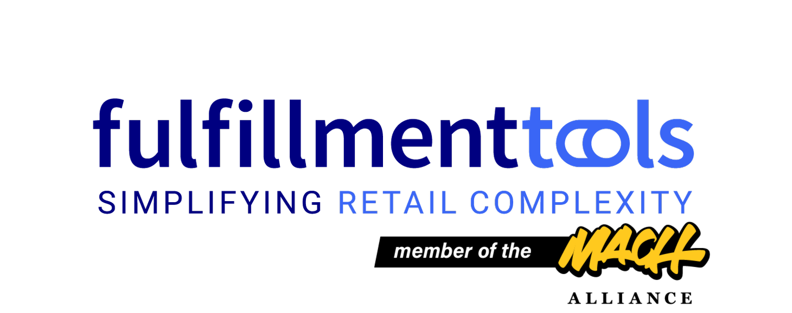
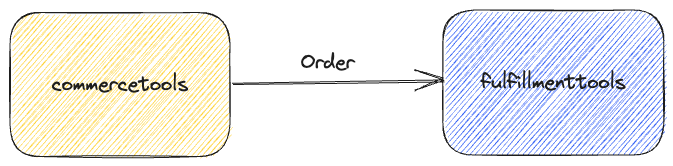
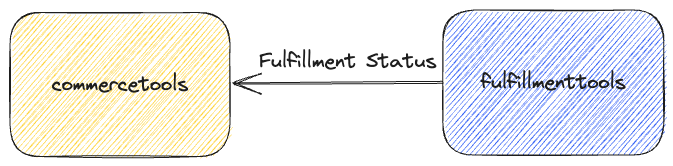

<p align="center">
  <a href="https://fulfillmenttools.com/">
    
  </a></br>
  <b>A commercetools Connect app by fulfillmenttools</b>
</p>


[](./LICENSE)
[](./CODE_OF_CONDUCT.md)
[](./CONTRIBUTING.md)

# 🤖 Introduction

This repository contains the source code and configuration of
the [commercetools Connect](https://docs.commercetools.com/connect/) applications built by [fufillmenttools](https://fulfillmenttools.com/).
These are [connect applications](https://marketplace.commercetools.com/) built in TypeScript using the [commercetools Connect Application Kit](https://github.com/commercetools/connect-application-kit#readme).

## 🔁 Functionality

The fulfillmenttools Connect app is a certified integration connector that can be used to exchange information between your _commercetools_ project and your _fulfillmenttools_ project. While fully customizable it is very easy to setup and deploy so you can start fulfilling orders from you e-commerce system without a complicated integration process.

### 🛒 Orders

The connector makes use of commercetools [subscriptions](https://docs.commercetools.com/api/projects/subscriptions) to get notified once the [OrderState](https://docs.commercetools.com/api/projects/orders#orderstate) of an Order is changed to `Confirmed`.
At this state the order information is read and a new order is [created](https://fulfillmenttools.github.io/api-reference-ui/#/Orders/addOrder) in the fulfillmenttools platform.



Depending on the shipping method of the commercetools order, either a Ship-from-Store order or a Click&Collect order is created in fulfillmenttools.

The fulfillmenttools distributed order management system (DOMS) will process the new order and (based on its configuration) route the order to the best fulfillment location. Then the actual fulfillment process of picking, packing, and shipping can be executed in the selected location.

### 📦 Fulfillment Status

As a result of the order routing process, a pick job will be created in the fulfillmenttools platform.
During the life time of the pick job (picking started, finished) and the corresponding handover job (created, handed over) the platform will send out events with status updates.
This information is processed by the connector to update custom fields and ultimately the [ShipmentState](https://docs.commercetools.com/api/projects/orders#shipmentstate) of the commercetools order.



The following events are used to update the commercetools order:

| Event                       | Action                                                                    |
| --------------------------- | ------------------------------------------------------------------------- |
| `ORDER_CREATED`             | Set custom field `fft_order_id`                                           |
| `PICK_JOB_CREATED`          | Set custom fields `fft_pickjob_id`, `fft_short_id`, and `fft_facility_id` |
| `PICK_JOB_PICKING_FINISHED` | Set custom field `fft_load_units_amount`                                  |
| `HANDOVERJOB_CREATED`       | Set custom field `fft_handoverjob_id`, update ShipmentState to `Ready`    |
| `HANDOVERJOB_HANDED_OVER`   | Update ShipmentState to `Shipped`                                         |

See the section on [customization](#⚙️-commercetools-customization) below for details on the used data fields.

## 👨‍💻 Development

### 👉 Requirements

- [Node.js](https://nodejs.org/en/) 18 with [NVM](https://github.com/nvm-sh/nvm) and npm
- [Docker](https://www.docker.com/get-started) (optional)

### 🛫 Setup

```bash
$ nvm use
```

### 🤸 Building and running the apps locally

This repository contains the two Connect apps `event` and `service` along with a `shared` module.
Each app is built and deployed separately.

The `shared` module contains functionality that is used by both apps.

All three modules are built in the same way:

```bash
$ npm install
$ npm run build
```

The `event` and `service` apps can be run locally using one of either goals:

```bash
$ npm run start
$ npm run start:dev
```

When running the app in _development_ mode the `.env.local` file will be used (also for running unit tests).

To run the app in _production_ mode, you need to provide a `.env` file (but do not check this into the git repository).

Do **not** check actual passwords etc. into the git repository!

### 🕵️ Running unit tests

When running unit tests the `.env.local` file will be used with dummy settings.

```bash
$ npm run test
```

### 🕵️‍♀️ Linting

```bash
$ npm run lint
```

## 🔗 Integration of commercetools and fulfillmenttools

This section describes the necessary steps to integrate the connector with commercetools and fulfillmenttools, so that

- order information is forwarded from commercetools to fulfillmenttools, and
- fulfillment status updates are sent back from fulfillmenttools to commercetools.

Have a look at the [commercetools documentation](https://docs.commercetools.com/docs/) for further details.

### 🙋‍♂️ Commercetools API client

For each commercetools project we need an API client (managed in merchant center under Settings > Developer settings) with at
least the following scopes:

- `manage_orders`
- `manage_order_edits`
- `manage_states`
- `manage_subscriptions`
- `manage_types`
- `view_products`
- `view_published_products`
- `view_stores`

Use the received credentials to set `CTP_CLIENT_ID` and `CTP_CLIENT_SECRET` when deploying the app.

### ⚙️ Commercetools customization

The connect apps use a Configuration [Custom Object](https://docs.commercetools.com/api/projects/custom-objects) identified by container `fft` and key `configuration` with the following settings:

| Setting                            | Description                                                                                                                                                                                                                                                                                                                                                                                                                                                                                                                             |
| ---------------------------------- | --------------------------------------------------------------------------------------------------------------------------------------------------------------------------------------------------------------------------------------------------------------------------------------------------------------------------------------------------------------------------------------------------------------------------------------------------------------------------------------------------------------------------------------- |
| `collectChannelReferenceFieldName` | Name of custom field in a commercetools [Order](https://docs.commercetools.com/api/projects/orders) that holds the key of a channel that should be used for a Click&Collect order. This field can freely be defined by the customer. When the fulfillmenttools connect app receives a commercetools Order it checks if this custom field is present. If so, the value of the field is used to identify the fulfillmenttools [Facility](https://docs.fulfillmenttools.com/api-docs/use-cases/add-and-manage-facilities) for a C&C order. |
| `orderCustomTypeKey`               | Name of the commercetools [Custom Type](https://docs.commercetools.com/api/projects/types) that is used for the Orders. This can freely be chosen by the customer. When the fulfillmenttools connect app receives a commercetools Order it checks if it already has this type. Additional [Custom Fields](https://docs.commercetools.com/api/projects/custom-fields) are then added to this type and filled with information from the fulfillmenttools process.                                                                         |
| `shippingMethodMapping`            | This is a map where the key is the `key` of a commercetools [Shipping Method](https://docs.commercetools.com/api/projects/shippingMethods). For each shipping method you want to use in your commercetools project you have to define a mapping. The value object of the mapping is used to select the [Delivery Preferences](https://fulfillmenttools.github.io/api-reference-ui/#/Orders/addOrder) of the fulfillmenttools Order.                                                                                                     |

Here's an example of the configuration object. The shipping method with key `dhl` is mapped to the `DHL_V2` carrier. The shipping method with key `cc` designates a Click&Collect order. In commercetools the shipping methods keys can be freely defined while the fulfillmenttools carrier keys are fixed by the platform:

```json
{
  "collectChannelReferenceFieldName": "fft_supply_channel_for_click_and_collect",
  "orderCustomTypeKey": "orderCustomFields",
  "shippingMethodMapping": {
    "dhl": {
      "serviceType": "SHIPPING",
      "serviceLevel": "DELIVERY",
      "carriers": ["DHL_V2"]
    },
    "gls": {
      "serviceType": "SHIPPING",
      "serviceLevel": "DELIVERY",
      "carriers": ["GLS"]
    },
    "cc": {
      "serviceType": "CLICK_AND_COLLECT"
    }
  }
}
```

The following Order [Custom Fields](https://docs.commercetools.com/api/projects/custom-fields#customfields) are used by the connect apps and the configured custom [Type](https://docs.commercetools.com/api/projects/types) is automatically extended with these fields:

- `fft_order_id`
- `fft_pickjob_id`
- `fft_load_units_amount`
- `fft_handover_job_id`
- `fft_shortid`
- `fft_facility_id`
- `fft_parcels`

### 📫 Setup commercetools subscription

This is automatically done by the `connector:post-deploy` script which is invoked after the app has been deployed into a commercetools environment.

### 📫 Setup fulfillmenttools subscriptions

This is automatically done by the `connector:post-deploy` script which is invoked after the app has been deployed into a commercetools environment.

## 🏰 Architecture principles for building a commercetools Connect application

- Connector solution should be lightweight in nature
- Connector solutions should follow test driven development. Unit , Integration (& E2E) tests should be included and successfully passed to be used
- No hardcoding of customer related config. If needed, values in an environment file which should not be maintained in repository
- Connector solution should be supported with detailed documentation
- Connectors should be point to point in nature, currently doesnt support any persistence capabilities apart from in memory persistence
- Connector solution should use open source technologies, although connector itself can be private for specific customer(s)
- Code should not contain `console.log` statements, use [the included logger](https://github.com/commercetools/merchant-center-application-kit/tree/main/packages-backend/loggers#readme) instead.

## 📜 License

All code in this repository is licensed under the [MIT license](https://github.com/fulfillmenttools/commercetools-connector/blob/master/LICENSE).

## 🙌 Contributing

We'd love to have your helping hand on this ecosystem! Please see [CONTRIBUTING.md](./CONTRIBUTING.md) for more information on our guidelines.

## :blue_heart: Thanks

Thanks for all your contributions and efforts towards improving the fulfillmenttools commercetools Connect app. We thank you for being part of our :sparkles: community :sparkles:!
