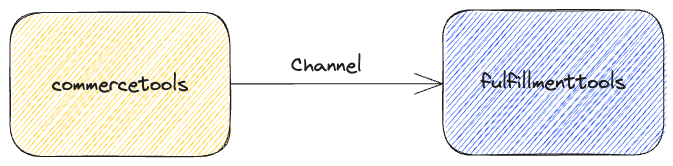

# fulfillmenttools connector

<p align="center">
  <a href="https://fulfillmenttools.com/">
    
  </a></br>
</p>

[](https://github.com/fulfillmenttools/commercetools-connector/releases)
[](https://github.com/fulfillmenttools/commercetools-connector/actions/workflows/ci.yml)
[](https://sonarcloud.io/project/overview?id=fulfillmenttools_commercetools-connector)
[](./LICENSE)
[](./CODE_OF_CONDUCT.md)
[](./CONTRIBUTING.md)
[](https://www.typescriptlang.org/)

# 🤖 Introduction

This repository contains the source code and configuration of
the [commercetools Connect](https://docs.commercetools.com/connect/) applications built by [fufillmenttools](https://fulfillmenttools.com/).
These are [Connect applications](https://marketplace.commercetools.com/) built in TypeScript using the [commercetools Connect Application Kit](https://github.com/commercetools/connect-application-kit#readme).

## 🔁 Functionality

The fulfillmenttools Connect app is a certified integration connector that can be used to exchange information between your commercetools project and your fulfillmenttools project. While fully customizable it's very easy to setup and deploy so you can start fulfilling orders from you eCommerce system without a complicated integration process. It's available in the [commercetools Connect marketplace](https://docs.commercetools.com/merchant-center/connect).

### 🛒 Orders

The connector makes use of [commercetools subscriptions](https://docs.commercetools.com/api/projects/subscriptions) to get notified once the [OrderState](https://docs.commercetools.com/api/projects/orders#orderstate) of an Order is changed to `Confirmed`.
At this state the order information is read and a new order is [created](https://fulfillmenttools.github.io/fulfillmenttools-api-reference-ui/#post-/api/orders) in fulfillmenttools.


Depending on the shipping method of the commercetools order, either a ship-from-store order or a click-and-collect order is created in fulfillmenttools.

fulfillmenttools will process the new order and (based on its configuration) route the order to the best fulfillment location. Then the actual fulfillment process of picking, packing, and shipping can be executed in the selected location.

### 📦 Fulfillment status

As a result of the order routing process, a pick job will be created in fulfillmenttools.
During the lifecycle of the pick job (picking started, finished) and the corresponding handover job (created, handed over) fulfillmenttools will send out events with status updates.
This information is processed by the connector to update custom fields and ultimately the [ShipmentState](https://docs.commercetools.com/api/projects/orders#shipmentstate) of the commercetools order.


The following events are used to update the commercetools order:

| Event                       | Action                                                                    |
| --------------------------- | ------------------------------------------------------------------------- |
| `ORDER_CREATED`             | Set custom field `fft_order_id`                                           |
| `PICK_JOB_CREATED`          | Set custom fields `fft_pickjob_id`, `fft_short_id`, and `fft_facility_id` |
| `PICK_JOB_PICKING_FINISHED` | Set custom field `fft_load_units_amount`                                  |
| `HANDOVERJOB_CREATED`       | Set custom field `fft_handoverjob_id`, update ShipmentState to `Ready`    |
| `HANDOVERJOB_HANDED_OVER`   | Update ShipmentState to `Shipped`                                         |

See the section on [customization](#⚙️-commercetools-customization) below for details on the used data fields.

### Channels

The connector also synchronizes information from [commercetools channels](https://docs.commercetools.com/api/projects/channels) to create or update a fulfillmenttools [facility](https://fulfillmenttools.github.io/fulfillmenttools-api-reference-ui/#post-/api/facilities). Note that only channels with the `InventorySupply` role are synchronized, other roles are ignored. The created fulfillmenttools facility will be of type `STORE` and have the `SHIP_FROM_STORE` and `PICKUP` services enabled. In a future version of this connector, we will support channel custom fields to configure the facility type and services.



The channel `key` is used as facility `tenantFacilityId` to establish a relationship between the two entities.
When the commercetools channel has an address, it's used as the facility's address, otherwise a default is used, because an address is mandatory for a fulfillmenttools facility. In this case, you may have to update/edit the facility with the correct data, see the [facility article in our documentation](https://docs.fulfillmenttools.com/documentation/getting-started/facilities) for details.

When the commercetools channel is deleted, the related fulfillmenttools facility is not deleted but only set to `OFFLINE`. This is to prevent accidental deletion of operational data. You can still delete the facility via the API or in Backoffice.

Currently, the synchronization between channels and facilities is in one direction only. Any changes made to a fulfillmenttools facility will not be forwarded to related commercetools channel.

## 🚀 Deployment

### 👉 Prerequisites

1. [commercetools core commerce account](https://commercetools.com/free-trial) and [commercetools API client](https://docs.commercetools.com/merchant-center/api-clients)
2. [fulfillmenttools account](https://www.fulfillmenttools.com/free-trial) and [API credentials](https://docs.fulfillmenttools.com/documentation/getting-started/access-to-fulfillmenttools-apis)

### Installing the connector

While you can deploy the connector into your core commerce project using the [Connect API](https://docs.commercetools.com/connect/deployments), the easiest way to deploy it is using the Merchant Center. In your project go to the Connect marketplace, select the fulfillmenttools Connector, click **Install** and follow the steps for deployment.

### Uninstalling the connector

You can undeploy the connector from your project using the [Connect API](https://docs.commercetools.com/connect/deployments) or use the Merchant Center.

## 👨‍💻 Development

### 👉 Requirements

- [Node.js](https://nodejs.org/en/) 20 with [NVM](https://github.com/nvm-sh/nvm) and npm
- [Docker](https://www.docker.com/get-started) (optional)

### 🛫 Setup

```bash
$ nvm use
```

### 🤸 Building and running the apps locally

This repository contains the two Connect apps `event` and `service` along with a `shared` module.
Each app is built and deployed separately.

The `shared` module contains functionality that is used by both apps.

All three modules are built in the same way:

```bash
$ npm install
$ npm run build
```

The `event` and `service` apps can be run locally using one of either goals:

```bash
$ npm run start
$ npm run start:dev
```

When running the app in _development_ mode the `.env.local` file will be used (also for running unit tests).

To run the app in _production_ mode, you need to provide a `.env` file (but do not check this into the git repository).

Do not check actual passwords into the git repository.

### 🕵️ Running unit tests

When running unit tests the `.env.local` file will be used with placeholder settings.

```bash
$ npm run test
```

### 🕵️‍♀️ Linting

```bash
$ npm run lint
```

## 🔗 Integration of commercetools and fulfillmenttools

This section describes the necessary steps to integrate the connector with commercetools and fulfillmenttools, so that

- order information is forwarded from commercetools to fulfillmenttools, and
- fulfillment status updates are sent back from fulfillmenttools to commercetools.

Have a look at the [commercetools documentation](https://docs.commercetools.com/docs/) for further details.

### 🙋‍♂️ Commercetools API client

For each commercetools project we need an [API client](https://docs.commercetools.com/merchant-center/api-clients) (managed in Merchant Center under Settings > Developer settings) with at least the following scopes:

- `manage_orders`
- `manage_states`
- `manage_subscriptions`
- `manage_types`
- `view_products`
- `view_project_settings`
- `view_published_products`
- `view_stores`

Use the received credentials to set `CTP_CLIENT_ID` and `CTP_CLIENT_SECRET` when deploying the app.

### ⚙️ commercetools customization

The connect apps use a configuration [custom object](https://docs.commercetools.com/api/projects/custom-objects) identified by container `fft` and key `configuration` with the following settings:

| Setting                            | Description                                                                                                                                                                                                                                                                                                                                                                                                                                                                                                                             |
| ---------------------------------- | --------------------------------------------------------------------------------------------------------------------------------------------------------------------------------------------------------------------------------------------------------------------------------------------------------------------------------------------------------------------------------------------------------------------------------------------------------------------------------------------------------------------------------------- |
| `collectChannelReferenceFieldName` | Name of custom field in a commercetools [Order](https://docs.commercetools.com/api/projects/orders) that holds the key of a channel that should be used for a click-and-collect order. You can define this field as you wish. When the fulfillmenttools connect app receives a commercetools order, it checks if this custom field is present. If so, the value of the field is used to identify the fulfillmenttools [facility](https://docs.fulfillmenttools.com/documentation/apps/backoffice/network-view/facilities) for a click-and-collect order. |
| `orderCustomTypeKey`               | Name of the commercetools [custom type](https://docs.commercetools.com/api/projects/types) that is used for the orders. This can freely be chosen by the customer. When the fulfillmenttools connect app receives a commercetools order it checks if it already has this type. Additional [custom fields](https://docs.commercetools.com/api/projects/custom-fields) are then added to this type and filled with information from the fulfillmenttools process.                                                                         |
| `shippingMethodMapping`            | This is a map where the key is the `key` of a commercetools [shipping method](https://docs.commercetools.com/api/projects/shippingMethods). For each shipping method you want to use in your commercetools project you have to define a mapping. The value object of the mapping is used to select the [delivery preferences](https://docs.fulfillmenttools.com/documentation/developer-docs/more-integration-guides/place-your-first-order/ship-from-store-orders) of the fulfillmenttools order.                                                                                                     |

Here's an example of the configuration object. The shipping method with key `dhl` is mapped to the `DHL_V2` carrier. The shipping method with key `cc` designates a click-and-collect order. In commercetools the shipping methods keys can be freely defined while the fulfillmenttools carrier keys are fixed:

```json
{
  "collectChannelReferenceFieldName": "fft_supply_channel_for_click_and_collect",
  "orderCustomTypeKey": "orderCustomFields",
  "shippingMethodMapping": {
    "dhl": {
      "serviceType": "SHIPPING",
      "serviceLevel": "DELIVERY",
      "carriers": ["DHL_V2"]
    },
    "gls": {
      "serviceType": "SHIPPING",
      "serviceLevel": "DELIVERY",
      "carriers": ["GLS"]
    },
    "cc": {
      "serviceType": "CLICK_AND_COLLECT"
    }
  }
}
```

The following order [custom fields](https://docs.commercetools.com/api/projects/custom-fields#customfields) are used by the connect apps and the configured [custom type](https://docs.commercetools.com/api/projects/types) is automatically extended with these fields:

- `fft_order_id`
- `fft_pickjob_id`
- `fft_load_units_amount`
- `fft_handover_job_id`
- `fft_shortid`
- `fft_facility_id`
- `fft_parcels`

### 📫 Setup commercetools subscription

This is automatically done by the `connector:post-deploy` script which is invoked after the app has been deployed into a commercetools environment.

### 📫 Setup fulfillmenttools subscriptions

This is automatically done by the `connector:post-deploy` script which is invoked after the app has been deployed into a commercetools environment.

### ❌ Deactivate events/services

By default, all three events/services are activated (order sync, facility sync, and status updates). However, you can deactivate each one individually by setting the corresponding value to `false` when installing the connector.

| VAR                         | Description                                                               |
| --------------------------- | ------------------------------------------------------------------------- |
| `FEAT_ORDERSYNC_ACTIVE`     | Set to `false` will deactivate the order sync (default is `true`)         |
| `FEAT_CHANNELSYNC_ACTIVE`   | Set to `false` will deactivate the channel sync (default is `true`)       |
| `FEAT_STATUSUPDATES_ACTIVE` | Set to `false` will deactivate the status updates (default is `true`)     |

## 🏰 Architecture principles for building a commercetools Connect application

- Connector solution should be lightweight in nature
- Connector solutions should follow test driven development. Unit, integration, and E2E tests should be included and successfully passed to be used
- No hardcoding of customer related config. If needed, values in an environment file which should not be maintained in repository
- Connector solution should be supported with detailed documentation
- Connectors should be point to point in nature, currently doesn't support any persistence capabilities apart from in memory persistence
- Connector solution should use open source technologies, although connector itself can be private for specific customer(s)
- Code should not contain `console.log` statements, use [the included logger](https://github.com/commercetools/merchant-center-application-kit/tree/main/packages-backend/loggers#readme) instead.

## 📜 License

All code in this repository is licensed under the [MIT license](https://github.com/fulfillmenttools/commercetools-connector/blob/master/LICENSE).

## 🙌 Contributing

We'd love to have your help on this ecosystem. See [the Contributing file](./CONTRIBUTING.md) for more information on our guidelines.

## :blue_heart: Thanks

Thanks for all your contributions and efforts towards improving the fulfillmenttools commercetools Connect app. And thanks for being part of our :sparkles: community :sparkles:!
